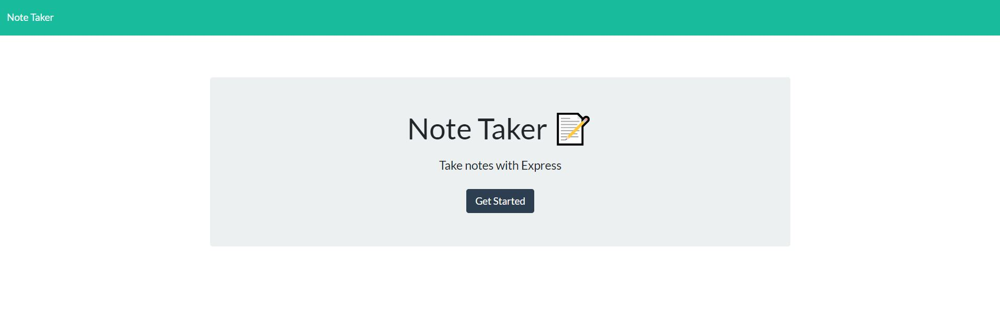
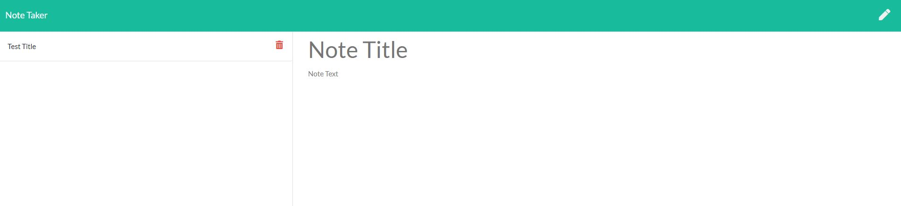

# Express Note Taker

  

  ## Table of Contents
  - [Description](#description)
  - [Installation](#installation)
  - [Usage Information](#usage-information)
  - [License](#license)
  - [Contribution Guidelines](#contribution-guidelines)
  - [Test Procedure](#test-procedure)
  - [Questions](#questions)
  - [Images](#images)

  ## Description
  Creating an application called Note Taker that can be used to create, save and delete notes. This application will use an Express.js backend and will save and retrieve note data from a JSON file. This app will be deployed on Heroku

  - [Deployed Express Note Taker](https://dry-plains-08093.herokuapp.com/)

  ## Installation
  To install, use "npm i express" and for coloured command prompts, use "npm i chalk"

  ## Usage Information
  Use this application to write and store notes as needed.

  ## License
  MIT

  ## Contribution Guidelines
  You can contribute freely

  ## Test Procedure
  n/a

  ## Questions
  If you have any questions, then feel free to contact me on the below:
  - Github: [bdjm94](https://github.com/bdjm94)
  - Email: [brendandjmoore@gmail.com](brendandjmoore@gmail.com)

  ## Images

  | Note Taker Home Page |
|------------|
  

  | Main Notes Page |
|------------|
  

  | Note Taker in Use |
|------------|
  

